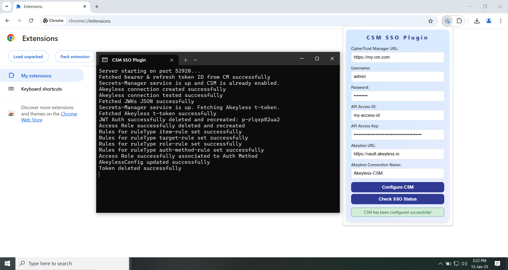
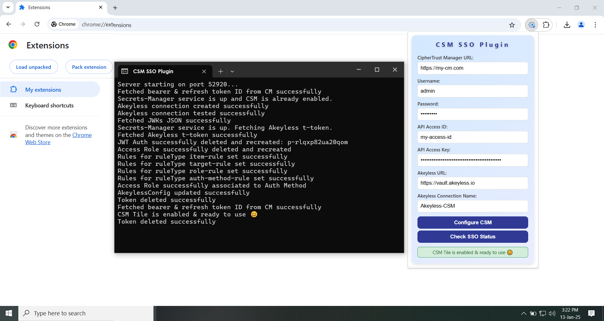

# CipherTrust Secrets Management SSO Plugin
If the CSM SSO Plugin helps you, consider giving us a ⭐ on **[GitHub](https://github.com/ThalesGroup/csm-sso-plugin)**! Your support encourages future development and helps others discover this tool!


**CSM SSO Plugin** is a browser extension that simplifies and automates the Single Sign-On (SSO) setup between CipherTrust Manager and Akeyless. With this plugin, users can configure SSO in under a minute, bypassing complex manual configurations. It seamlessly enables the CSM tile in the CipherTrust Manager for quick and secure access to Akeyless with minimal effort.

## Compatibility

- Tested with CipherTrust Manager Versions: 2.17.0 and above.
- Ensure your CipherTrust Manager is updated to the latest version to leverage the full functionality of the plugin.

## Getting Started

### A) Prerequisites

Before using the plugin, ensure the following:

1. **Supported Browsers**:  
   The plugin is compatible with the following browsers:
   - Google Chrome (recommended version: 79 and above)
   - Microsoft Edge (recommended version: 79 and above)
   - Brave (latest versions)
   - Opera (version 15 and above)
   - Vivaldi (latest versions)
   - Chromium-based browsers (all recent versions)
   - Yandex Browser (latest versions)

2. **User Credentials**:
   - A **CipherTrust Manager** account with administrative access.
   - An **Akeyless** account with administrative permissions for integration.

### B) Installation Guide

To install and pin the extension for any Chromium-based browser (e.g., Chrome, Edge, Brave, Opera, etc.), follow these steps:

1. **Download the Repository**:
   - Click the green **Code** button at the top of this GitHub page.
   - Select **Download ZIP** and save the ZIP file to your local machine.

2. **Extract the ZIP File**:
   - Locate the downloaded ZIP file and extract its contents to a folder on your computer.

3. **Open Extensions in Your Chromium-Based Browser**:
   - Open your **Chrome**, **Edge**, **Brave**, **Opera**, or any other Chromium-based browser.
   - Click the three dots (menu icon) in the top-right corner of the browser window.
   - Navigate to **Extensions**.

4. **Enable Developer Mode**:
   - In the **Extensions** tab, enable **Developer mode** by toggling the switch at the top-right corner.

5. **Load the Extension**:
   - Click on the **Load unpacked** button.
   - In the file selection window, navigate to the extracted folder from Step 2, select the **extension** folder, and click **Open**.

6. **Pin the Extension**:
   - After loading the extension, locate the puzzle icon in the browser toolbar (representing **Extensions**).
   - Click the puzzle icon, find your newly installed extension in the list, and click the **pin** icon next to it.
   - The extension icon will now appear directly in your browser toolbar for easy access.

7. **Launch the Extension**:
   - Click the extension icon in the toolbar to start using it.

## How to Execute the Plugin

After following these steps, the extension will be installed, pinned, and ready for use in your browser.

1. **Run the CSM Executable**:
   - Based on your operating system and architecture, locate the appropriate executable file in the **executable** folder of the extracted ZIP (under the `windows`, `macos`, or `linux` folder). The executables are available for both `amd64` and `x86` architectures. 

   - **Linux Users**:
     - Identify your system architecture (64-bit or 32-bit).
     - Open a terminal and navigate to the appropriate folder (`linux/amd64` or `linux/x86`).
     - Run the following command for 64-bit architecture:
       ```bash
       ./csm-linux-amd64
       ```
     - For 32-bit architecture, run:
       ```bash
       ./csm-linux-x86
       ```

   - **Windows Users**:
     - Identify your system architecture (64-bit or 32-bit).
     - Navigate to the appropriate folder (`windows/amd64` or `windows/x86`).
     - Double-click on `csm-windows-amd64.exe` for 64-bit systems, or `csm-windows-x86.exe` for 32-bit systems to launch it.

   - **Mac Users**:
     - macOS no longer supports 32-bit applications. Ensure you are using a 64-bit system.
     - Open a terminal and navigate to the `macos/amd64` folder.
     - Run the following command:
       ```bash
       ./csm-macos-amd64
       ```

     > **Note**: Ensure the executable has appropriate permissions to run, especially on Linux and macOS where you might need to use `chmod +x csm-linux-amd64` or `chmod +x csm-macos-amd64` to make them executable.

2. **Verify the CSM Executable is Running**:
   - Confirm that the CSM executable is running as expected. This may involve checking for logs or ensuring a process window remains open.

3. **Open the Extension in Your Browser**:
   - After running the CSM executable, open your browser.
   - Click the extension icon in the toolbar to launch the extension interface.
   - If it’s not visible, click the puzzle icon and select the extension from the list. You can also pin it to the toolbar for easier access.

4. **Enter Required Configuration Details**:
   - Provide the necessary inputs in the plugin to enter the required details for the SSO setup (e.g., CipherTrust Manager URL, credentials, connection name, etc.).

5. **Complete the Setup**:
   - Once the details are entered, click **Configure CSM** to apply the configuration.
   - The extension will automatically set up the necessary SSO settings and enable the CSM tile.

   

6. **Verify the SSO Setup**:
   - After configuration is complete, click **Check SSO Status** to check the CSM tile status.

   

After following these steps, your SSO integration to Akeyless should be fully configured and ready to use from CipherTrust Manager!

## Note
The plugin includes a **backend** folder containing GoLang source code used to generate the necessary executables. End users do not need to interact with the backend code to use the extension; it is provided solely for transparency and to offer visibility into the underlying implementation.

## Contributing

If you are interested in contributing to the CSM SSO Plugin, start by reading the [Contributing guide](/CONTRIBUTING.md).

## License

CSM SSO Plugin is licensed under the Apache 2.0 license. Please read [LICENSE](LICENSE) for more information.